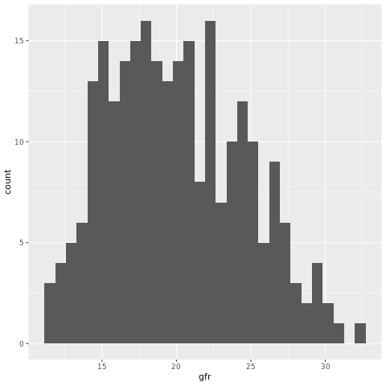

```{r setup, include=FALSE}
knitr::opts_chunk$set(echo = TRUE)
library(tidyverse)
```

# Background

We are excited in your interest to join our data science mentor team! We appreciate your time, so we've tried our best to design this take home project to be as useful and short as possible.

The primary objective for this take home project is to give you a chance to showcase your R programming skills. This project is based on a real Academy project that students work on over the course of 10 weeks, so it will give you a good idea of what topics & concepts you will cover with your students if you are offered an invitation into our mentor program. Your task for this take home assessment is to complete the 3 milestones below in about 1 hour.

# The Project

The original project was designed for professionals who work in life sciences. In that project, students were tasked to measure the effects of diet on kidney disease. Over the course of about 10 weeks, they worked with the provided data to determine if there was a difference in outcomes between 4 treatment groups and they created a final R Markdown report summarizing the results.

For this mentor take home assignment, we've trimmed the original project down into 3 separate milestones, rather than the standard \~10 milestones. Each milestone focuses on a different data science skill set. Don't worry, you don't need to have pharmaceutical experience. RStudio Academy students come from all industries and backgrounds, so we'll try our best to match you up with companies that you are most interested in working with.

# Instructions

## Mentor Milestone 1 (students usually cover this during week 1 + 2)

Import the project data and recreate the ggplot below. Then, extend the milestone by creating another plot to demonstrate your understanding of ggplot.

Step 1: Read in `baseline_data.xpt` (MDRD data) and recreate the plot below.

```{r}

```

Hint:

-  .xpt files (SAS Transport Files) can be imported with the help of the `haven` package

Recreate the plot in this chunk:

```{r milestone-1-recreation}
```

Step 2: Create a second plot below:

```{r milestone-1-extension}

```

## Mentor Milestone 2 (students usually cover this during week 3 & 4)

This milestone is all about joins and `dplyr`. You'll join a new data set to the MDRD data that contains information on patient age, sex, height, and weight. Your objective is to replicate the table below:

```{r, echo = FALSE, message = FALSE}
# recreate the table below
milestone_2 <- 
  read_csv(
    "data/milestone_2.csv"
  ) %>% 
  print()
```

Hints: 

-  Read in the data from `data/baseline_data.xpt` and `data/data_supplemental.xlsx` 
-  `data_dictionary.md` in the `data` folder explains the variables in both data sets (in case you'd like to learn more about the data) 
-  The formula for BMI is kilograms / meters\^2

Please do and save your work below:

```{r milestone-2-recreation}

```

For your extension, please demonstrate your understanding of summarizing data sets.

```{r milestone-2-extension}

```

## Mentor Milestone 3 (students usually cover this during week 9)

This milestone is about iteration with `purrr`. Your objective is to use iteration to load in the 100 files found in the `/data/milestone-3` directory.

Please do and save your work below:

```{r milestone-3-recreation}

```


For your milestone extension, please choose from the following 2 options:

-  Explain the difference between `map()` and its variants, such as `map_chr()`.
-  Share an example of how you've used `purrr` in the past.

Congrats! You've now finished the take home assignment. Please send this RMD doc to Hadrien\@rstudio.com for review and to schedule a call with a member of the RStudio mentor team.

## Other Topics We Cover With Students

Each cohort covers a select set of data science topics based on their specific learning goals, although often beginners will cover the same foundational topics. The majority of topics we teach are included in the book [R For Data Science](https://r4ds.had.co.nz/). In addition to the topics covered in this take home project, other important topics that we focus on include tidy data, pivoting, writing functions, some basic modeling, strings & dates, and creating tables with `gt`.
